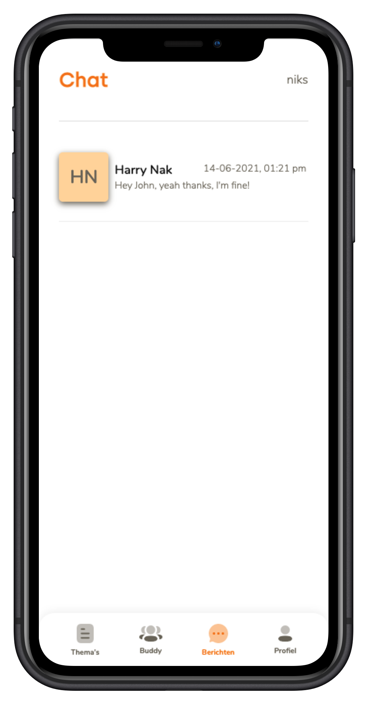

##### Meesterproef @cmda-minor-web 2020 - 2021

  [](https://bloom-hva.herokuapp.com/) [](shields.io)

# Bloom


_Meesterproef, a course of the minor Web Design & Development. It is a minor of the third year from the study [CMD](https://www.cmd-amsterdam.nl/)._

[Link to live version :rocket:](https://bloom-hva.herokuapp.com/)
### Table of Contents
<div style="margin-left: auto; margin-right: auto;margin: 0 auto;">
    <a href="#rocket-purpose-of-project">🚀 Purpose of Project </a>
    • <a href="#heart_eyes-concept">😍 Concept</a>
    • <a href="#1234-data">🔢 Data</a>
    • <a href="#nerd_face-technical-summary">🤓  Technical summary</a>
    • <a href="#gear-installation">⚙️ Installation</a>
    • <a href="#file_folder-sources">📁 Sources</a>
    • <a href="#cop-license">👮 License</a>
</div>

## :rocket: Purpose of Project

The reason the client started this project is that she has been personally involved in this disease. The client's mother has had breast cancer. She then started to talk a lot with her mother about the process afterward. However, there is still little instruction/approach to be found after the treatment project. It is clear during the treatment process what the approach is, but after that, it stops. Not much is known about that yet. That is why Eva got the idea to investigate this.

## Goal of the application

The purpose of this application is to connect people who have had or still have cancer. These people can tell their story together or find support from other users. The users can therefore find a 'buddy' with this app. The user can also indicate in the app what type of cancer they have had and this means that these people are matched based on the type of cancer.


## :heart_eyes: Concept
### What's it?
**bloom** is an application to connect people with each other who have had or still have cancer, these people can tell share their thought and opinions with others.

### Core feature/user scenario's
- As a user, I want information on relevant topics, so that I know what to expect after the treatment process.
- As a user, I want 1-on-1 contact with fellow sufferers, so that I can reflect on my experiences and strengthen my coping strategies.

### Features
- You can register an account via a Progressive Disclosure register process
- You can login onto your account
- You can assume a lot of information about cancer at the Themes page
- You can see other buddies
- You can filter the buddies
- You can match a buddy by beginning a chat with him/her
- You can chat with a buddy

### Tech-features
- passsword hashing
- vuex store encrypointg
- localstorage

### User Interface
Screenshots of the pages in the application





## :1234: Data  
We used Mongoose data schemas to create schemas before we insert the data.
### User schema
lorem ipsum 
This data in db is created by the register function

```js
{
  firstName: String,
  surName: String,
  emailAddress: String,
  password: String,
  birthDate: String,
  town: String,
  gender: String,
  typeIllness: Array,
  profileAvatar: String,
  about: String,
}

```

### Chat schema
lorem ipsum 
This data is created as ```lorem``` by default when you want to chat with someone. (function object). This data can be manipulated by the accept of the other partiicpant. or delte, then this object iwll bee delted in db. Or New message via socket will also be pushed to db for later visit on chat (messages history).

```js
{
  request: {
    creater: String,
    accepted: Boolean,
  },
  participants: Array,
  messages: [
    {
      sender: String,
      content: String,
      time: String,
    },
  ],
}

```

## :nerd_face: Technical summary
This app is built, using:
- _Mobile First technique_
- [npm](https://www.npmjs.com/)
- [Node.js server](https://nodejs.org/)
- [Express router](https://expressjs.com/)
- [Vue frontend framework](https://vuejs.org/)
- [Vuex](https://vuex.vuejs.org/guide/#the-simplest-store)
- [Vue Router](https://router.vuejs.org/)
- [Mongoose](https://mongoosejs.com/)
- [Socket.io](http://socket.io/)
- [Heroku deployment](https://www.heroku.com/nodejs)


## :gear: Installation
>⚠️ To use the application in development, you need a MongoDB database and a URI to connect with it! Please contact us if you want to run the project.

1. Clone the repository:  
```
git clone https://github.com/RowinRuizendaal/Bloom.git
```

2. Install dependencies client & server   
``` 
cd client && npm install

cd server && npm install
```

3. To run the app   
```
cd client && npm run serve

cd server && npm run dev
```

4. Go to [localhost](http://localhost:8080/) in the browser and voilà :sparkles:
```
http://localhost:8080/
```

### Compiles and minifies for production
```
npm run build
```

### Lints and fixes files
```
npm run lint
```

### Customize configuration
See [Configuration Reference](https://cli.vuejs.org/config/).


## :file_folder: Sources
Credits to [Eva Valkenburg](https://www.evavalkenburg.nl/) for giving us this awesome exercise.

### Code sources
- Stackoverflow (n.d.). Searching for answers on dev questions - Stackoverflow. Retrieved 18 May 2021 from https://www.stackoverflow.com

- https://bezkoder.com/vue-node-express-mongodb-mevn-crud/

- https://bezkoder.com/vue-js-crud-app/

## :cop: License
[](https://opensource.org/licenses/MIT)  
This project from [Ralf](https://github.com/ralfz123) and [Rowin](https://github.com/RowinRuizendaal) has a [MIT © License](https://github.com/RowinRuizendaal/Bloom/blob/main/LICENSE)
