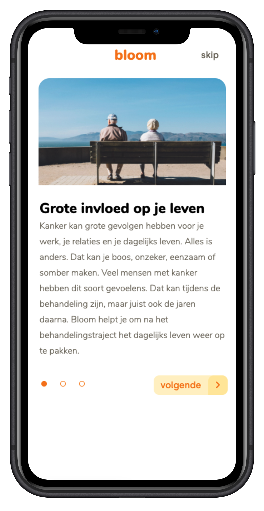
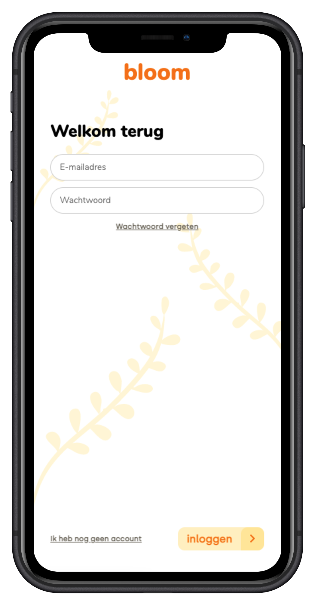
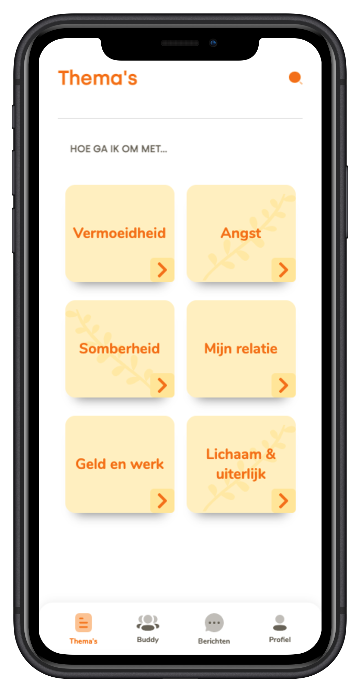
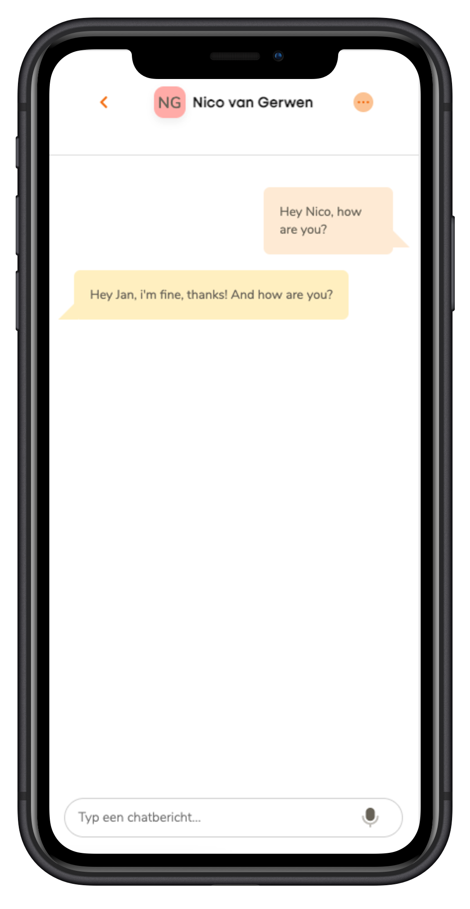

##### Meesterproef @cmda-minor-web 2020 - 2021

  [](https://bloom-hva.herokuapp.com/) [](shields.io)

# Bloom


_Meesterproef, a course of the minor Web Design & Development. It is a minor of the third year from the study [CMD](https://www.cmd-amsterdam.nl/)._

[Link to live version :rocket:](https://bloom-hva.herokuapp.com/)
### Table of Contents
<div style="margin-left: auto; margin-right: auto;margin: 0 auto;">
    <a href="#rocket-purpose-of-project">🚀 Purpose of Project </a>
    • <a href="#goal-of-the-application">🎯 Goal of the application</a>
    • <a href="#heart_eyes-concept">😍  Concept</a>
    • <a href="#progressive-web-app"> 📱 Progressive Web App</a>
    • <a href="#1234-data">🔢  Data</a>
    • <a href="#nerd_face-technical-summary">🤓  Technical summary</a>
    • <a href="#folderstructure">🗂 Folderstructure</a>
    • <a href="#gear-installation">⚙️ Installation</a>
    • <a href="#file_folder-sources">📁 Sources</a>
    • <a href="#cop-license">👮 License</a>
</div>

## :rocket: Purpose of Project

The reason the client started this project is that she has been personally involved in this disease. The client's mother has had breast cancer. She then started to talk a lot with her mother about the process afterward. However, there is still little instruction/approach to be found after the treatment project. It is clear during the treatment process what the approach is, but after that, it stops. Not much is known about that yet. That is why Eva got the idea to investigate this.

## Goal of the application

The purpose of this application is to connect people who have had or still have cancer. These people can tell their story together or find support from other users. The users can therefore find a 'buddy' with this app. The user can also indicate in the app what type of cancer they have had and this means that these people are matched based on the type of cancer.

## :heart_eyes: Concept
### What's it?
**bloom** is an application to connect people with each other who have had or still have cancer, these people can tell share their thought and opinions with others.

### Core feature/user scenario's
- As a user, I want information on relevant topics, so that I know what to expect after the treatment process.
- As a user, I want 1-on-1 contact with fellow sufferers, so that I can reflect on my experiences and strengthen my coping strategies.

### Features
- You can register an account via a Progressive Disclosure register process
- You can login onto your account
- You can assume a lot of information about cancer at the Themes page
- You can see other buddies
- You can filter the buddies
- You can see a buddy's profile page
- You can match a buddy by beginning a chat with him/her
- You can accept or deny a chat request
- You can chat real-time with a buddy
- You can view your own profile
- You can download the website as application for any device

### Tech-features
#### Passsword hashing

Hashing passwords will protect it from attacks from inside, Hashing makes it a lot harder for someone to crack our passwords, for example, the string `'hey'` becomes `'$2b$10$rh8HVb2fHEXjZgyen17/Xe8qVOmvtdcgHQo6xc6hzvBu3rG1T7QAm'`.

What hashing method do we use?

As password hashing function we use 'bcrypt. bcrypt is a password-hashing function designed by Niels Provos and David Mazières, based on the Blowfish cipher and presented at USENIX in 1999. Besides incorporating a salt to protect against rainbow table attacks, bcrypt is an adaptive function: over time, the iteration count can be increased to make it slower, so it remains resistant to brute-force search attacks even with increasing computation power. The bcrypt function is the default password hash algorithm for OpenBSD and other systems including some Linux distributions such as SUSE Linux. There are implementations of bcrypt for C, C++, C#, Elixir, Go, Java, JavaScript, Perl, PHP, Python, Ruby, and other languages.


##### Why?

While doing our research I found out that there were different tutorial videos s/guides on the internet for bcrypt, the other ones were a bit hard to understand or they had a complex guide on how to use it. So we picked bcrypt because it is easy to use and I could follow the guides for research. Scypt is a safe hashing method but really complex with KDF, this implementation would require more research and our app is safer with just bcrypt.


##### How?

```js
const bcrypt = require('bcrypt');
const saltRounds = 10;

  // Salt the plain password
  const passwordHash = bcrypt.hashSync(req.body.password, saltRounds);

  const userObject = {
    firstName: req.body.firstName,
    surName: req.body.surName,
    emailAddress: req.body.emailAddress,
    password: passwordHash,
    birthDate: req.body.birthDate,
    town: req.body.town,
    gender: req.body.gender,
    typeIllness: req.body.typeIllness,
    profileAvatar: req.body.profileAvatar,
    about: req.body.about,
  };
```
What are saltrounds?

With "salt round" they actually mean the cost factor. The cost factor controls how much time is needed to calculate a single BCrypt hash. The higher the cost factor, the more hashing rounds are done. Increasing the cost factor by 1 double the necessary time. The more time is necessary, the more difficult is brute-forcing.
```
rounds=8 : ~40 hashes/sec
rounds=9 : ~20 hashes/sec
rounds=10: ~10 hashes/sec
rounds=11: ~5  hashes/sec
rounds=12: 2-3 hashes/sec
rounds=13: ~1 sec/hash
rounds=14: ~1.5 sec/hash
rounds=15: ~3 sec/hash
rounds=25: ~1 hour/hash
rounds=31: 2-3 days/hash
```

#### Vuex store/localstorage encrypting

##### Why?

We are using an encryption method with LS, to make sure that our localstorage data is encrypted, we have choosen this method because the localstorage can have personal data in it, to make sure that it is not plain text, we have decided to encrypt this.

##### How?

```js
import createPersistedState from "vuex-persistedstate";
import SecureLS from "secure-ls";
const ls = new SecureLS({ isCompression: false });

  plugins: [
    createPersistedState({
      storage: {
        getItem: (key) => ls.get(key),
        setItem: (key, value) => ls.set(key, value),
        removeItem: (key) => ls.remove(key),
      },
    }),
  ]
```


#### Realtime Chat
##### Why?
This feature is built with socketIO. The package [vue-socket.io](https://vue-socket.io/) helped a lot also. With this feature you can chat with other people. First you join a room, that checks if there is already chat history. When there is, it sends you from the server the chat history. After that you can chat with the person you are in the room.

##### How?
###### Events
|ClientSide|ServerSide|
|---|---|
|[joinRoom](https://github.com/RowinRuizendaal/Bloom/blob/master/server/app/controllers/socket.controllers.js#L21-L66) |[joinRoomHandler](https://github.com/RowinRuizendaal/Bloom/blob/master/server/app/controllers/socket.controllers.js#L21-L66)|
|[roomData](https://github.com/RowinRuizendaal/Bloom/blob/master/client/src/views/chat/chatDetail.vue#L153-L176)|[roomData](https://github.com/RowinRuizendaal/Bloom/blob/master/server/app/controllers/socket.controllers.js#L58-L61)|
|[newMessage](https://github.com/RowinRuizendaal/Bloom/blob/master/client/src/views/chat/chatDetail.vue#L178-L182)| [newMessageHandler](https://github.com/RowinRuizendaal/Bloom/blob/master/server/app/controllers/socket.controllers.js#L80-L92)|

#### Chat overview order & Timestamp
##### Why?
We implemented a feature in the chat overview page where the chats are ordened by timestamp. This is an added value for the users, because it is then clear to the users which chat is the most recent and is therefore at the top. This eliminates the need for the user to search through all chats.

##### How?
Sorting the chats is thus done by retrieving the last message of all chat objects. There it looks at the timestamp contained in the object. The timestamp is in seconds, so that is very accurate to calculate which day and time that is. When the timestamp of the chat message corresponds to the day the user is viewing, only the timestamp will be displayed and not the date. Older posts will include the date. All those chat objects are pushed into an array which is then sorted using the `.sort()` method. Then the array is rendered in the page and so the chat overview always keeps the most recent chats at the top.


###### Sorting the chats by timestamp
```js
allChats.sort(function (a, b) {
  return b.timeSort.message.time - a.timeSort.message.time;
});
```

###### Checks if the timestamp matches the date when the user looks at it.
```js
convertTime(timestamp) {
  let timeStampMsg = timestamp * 1000;
  let todayHours = new Date().setHours(0, 0, 0, 0);
  let chatTimeHours = new Date(timeStampMsg).setHours(0, 0, 0, 0);
  if (todayHours === chatTimeHours) {
    // Message is from today
    // format to correct
    let formattedDate = moment(timeStampMsg).format("HH:mm");
    return formattedDate;
  } else {
    // Message is from not today
    // format to correct
    let formattedDate = moment(timeStampMsg).format("DD-MM-YYYY, HH:mm");
    return formattedDate;
  }
};
```

## Progressive Web App
A progressive web application (PWA) is a type of application software delivered through the web, built using common web technologies including HTML, CSS and JavaScript. It is intended to work on any platform that uses a standards-compliant browser, including both desktop and mobile devices.

Improvements:
- Fast loading of the pages
- Render pages while being offline
- Cache pages you've visited before
- Update cache pages while there is new content

Also this improves the UX a bit, because the speed of the app is improved by the service worker and the pages are still available even when the user has no internet connection.

### Features
#### 1. Install the app
You can install the application from the browser to your homescreen. So you can get the whole app experience when you start the application.

##### Icon


##### Mobile


##### Desktop


##### Created by [`vue.config.js`](https://github.com/RowinRuizendaal/Bloom/blob/master/client/vue.config.js#L19-L58)
This file takes care of the design of the app if you have it installed on your device. This includes the theme color and favicons.

```js
pwa: {
  manifestOptions: {
    name: "bloom",
    short_name: "bloom",
    start_url: "./",
    theme_color: "#fef1c5",
    msTileColor: "#ffffff",
    appleMobileWebAppCapable: "yes",
    appleMobileWebAppStatusBarStyle: "black",
    icons: [
      {
        src: "./img/icons/favicon-32x32.png",
        sizes: "32x32",
        type: "image/png",
      },
      {
        src: "./img/icons/favicon-16x16.png",
        sizes: "16x16",
        type: "image/png",
      },
      {
        src: "./img/icons/android-chrome-512x512.png",
        sizes: "512x512",
        type: "image/png",
      },
      {
        src: "./img/icons/android-chrome-192x192.png",
        sizes: "192x192",
        type: "image/png",
      },
    ],
    // configure the workbox plugin
    workboxPluginMode: "InjectManifest",
    workboxOptions: {
      // swSrc is required in InjectManifest mode.
      swSrc: "./registerServiceWorker.js",
      // ...other Workbox options...
    },
  },
},
```
#### 2. Cache
The app remembers the pages you've visited. So when you are offline (not connected to the internet) you can use the app in offline mode with all the cached pages you have visited. Also, if you are online and visit pages that are already cached, you will be served the page from the cache, so the speed of the app is super fast.

##### Created by [`registerServiceWorker.js`](https://github.com/RowinRuizendaal/Bloom/blob/master/client/src/registerServiceWorker.js#L5-L33)
This file registers the service worker and finally caches the visited pages. This makes the app also available offline. When the app uses the visited pages from the cache, it helps to increase the speed of the app.

```js
if (process.env.NODE_ENV === "production") {
  register(`${process.env.BASE_URL}service-worker.js`, {
    ready() {
      console.log(
        "App is being served from cache by a service worker.\n" +
          "For more details, visit https://goo.gl/AFskqB"
      );
    },
    registered() {
      console.log("Service worker has been registered.");
    },
    cached() {
      console.log("Content has been cached for offline use.");
    },
    updatefound() {
      console.log("New content is downloading.");
    },
    updated() {
      console.log("New content is available; please refresh.");
    },
    offline() {
      // eslint-disable-next-line max-len
      console.log("No internet connection found. App is running in offline mode.");
    },
    error(error) {
      console.error("Error during service worker registration:", error);
    },
  });
}
```


### User Interface
Screenshots of the pages in the application
#### Authentication

<p float="left">







</p>


#### Onboarding
<p float="left">


</p>

#### Themes

<p float="left">

  

  
  </p>
  
  
  #### Buddies
  
  <p float="left">

  

  

  

  
  </p>

  
  #### Chats
  <p float="left">
  
  

  

  
  </p>

  
#### Profile

  <p float="left">

  

</p>

## :1234: Data  
We used Mongoose data schemas to create schemas before we insert the data.
### User schema

This data in the database is created in the [createUser function](https://github.com/RowinRuizendaal/Bloom/blob/master/server/app/helpers/db.helpers.js#L41-L67).

```js
{
  firstName: String,
  surName: String,
  emailAddress: String,
  password: String,
  birthDate: String,
  town: String,
  gender: String,
  typeIllness: Array,
  profileAvatar: String,
  about: String,
}
```

### Chat schema
This data in the database is created in the [createChat function](https://github.com/RowinRuizendaal/Bloom/blob/master/server/app/helpers/db.helpers.js#L185-L1907). The data can be manipulated by the [socket events](https://github.com/RowinRuizendaal/Bloom/blob/master/server/app/controllers/socket.controllers.js).

```js
{
  request: {
    creater: String,
    accepted: Boolean,
  },
  participants: Array,
  messages: [
    {
      sender: String,
      content: String,
      time: String,
    },
  ],
}
```


## :nerd_face: Technical summary
This app is built, using:
- _Mobile First technique_
- [npm](https://www.npmjs.com/)
- [Node.js server](https://nodejs.org/)
- [Express router](https://expressjs.com/)
- [Vue frontend framework](https://vuejs.org/)
- [Vuex](https://vuex.vuejs.org/guide/#the-simplest-store)
- [Vue Router](https://router.vuejs.org/)
- [Vue PWA](https://cli.vuejs.org/core-plugins/pwa.html)
- [Vue tour](https://github.com/pulsardev/vue-tour)
- [Mongoose](https://mongoosejs.com/)
- [Socket.io](http://socket.io/)
- [bcrypt](https://www.npmjs.com/package/bcrypt)
- [Heroku deployment](https://www.heroku.com/nodejs)

## Folderstructure
>⚠️ Warning: prepare for a lot of files

<details>
<summary>Client</summary>

```
📦client
 ┣ 📂node_modules
 ┣ 📂public
 ┃ ┣ 📂favicon
 ┃ ┣ 📂fonts
 ┃ ┣ 📂img
 ┃ ┣ 📜favicon.ico
 ┃ ┣ 📜index.html
 ┃ ┗ 📜robots.txt
 ┣ 📂src
 ┃ ┣ 📂assets
 ┃ ┃ ┣ 📂icons
 ┃ ┃ ┣ 📂onboarding
 ┃ ┃ ┣ 📂scss
 ┃ ┃ ┃ ┣ 📂variables
 ┃ ┃ ┃ ┃ ┣ 📜_assets.scss
 ┃ ┃ ┃ ┃ ┣ 📜_colors.scss
 ┃ ┃ ┃ ┃ ┣ 📜_responsive.scss
 ┃ ┃ ┃ ┃ ┗ 📜_typography.scss
 ┃ ┃ ┃ ┗ 📜main.scss
 ┃ ┃ ┣ 📂svg
 ┃ ┃ ┣ 📂themes
 ┃ ┃ ┗ 📜logo.png
 ┃ ┣ 📂components
 ┃ ┃ ┣ 📂buddies
 ┃ ┃ ┃ ┣ 📜buddies.scss
 ┃ ┃ ┃ ┗ 📜buddyDetail.scss
 ┃ ┃ ┣ 📂button
 ┃ ┃ ┃ ┣ 📜button.scss
 ┃ ┃ ┃ ┗ 📜button.vue
 ┃ ┃ ┣ 📂chat
 ┃ ┃ ┃ ┣ 📜chatDetail.scss
 ┃ ┃ ┃ ┣ 📜chatOverview.scss
 ┃ ┃ ┃ ┗ 📜chatRequest.scss
 ┃ ┃ ┣ 📂error
 ┃ ┃ ┃ ┣ 📜error.scss
 ┃ ┃ ┃ ┗ 📜error.vue
 ┃ ┃ ┣ 📂home
 ┃ ┃ ┃ ┗ 📜home.scss
 ┃ ┃ ┣ 📂login
 ┃ ┃ ┃ ┗ 📜login.scss
 ┃ ┃ ┣ 📂nav
 ┃ ┃ ┃ ┣ 📜nav.scss
 ┃ ┃ ┃ ┗ 📜nav.vue
 ┃ ┃ ┣ 📂onboarding
 ┃ ┃ ┃ ┗ 📜onboarding.scss
 ┃ ┃ ┣ 📂profile
 ┃ ┃ ┃ ┗ 📜profile.scss
 ┃ ┃ ┣ 📂register
 ┃ ┃ ┃ ┗ 📜register.scss
 ┃ ┃ ┣ 📂textarea
 ┃ ┃ ┃ ┣ 📜textarea.scss
 ┃ ┃ ┃ ┗ 📜textarea.vue
 ┃ ┃ ┗ 📂themes
 ┃ ┃ ┃ ┣ 📜slug.scss
 ┃ ┃ ┃ ┗ 📜theme.scss
 ┃ ┣ 📂router
 ┃ ┃ ┗ 📜index.js
 ┃ ┣ 📂services
 ┃ ┃ ┗ 📜DataService.js
 ┃ ┣ 📂store
 ┃ ┃ ┗ 📜index.js
 ┃ ┣ 📂views
 ┃ ┃ ┣ 📂buddies
 ┃ ┃ ┃ ┣ 📜buddies.vue
 ┃ ┃ ┃ ┗ 📜buddyDetail.vue
 ┃ ┃ ┣ 📂chat
 ┃ ┃ ┃ ┣ 📜chatDetail.vue
 ┃ ┃ ┃ ┣ 📜chatOverview.vue
 ┃ ┃ ┃ ┗ 📜chatRequest.vue
 ┃ ┃ ┣ 📂login
 ┃ ┃ ┃ ┣ 📂register
 ┃ ┃ ┃ ┃ ┣ 📜eightStep.vue
 ┃ ┃ ┃ ┃ ┣ 📜fifthStep.vue
 ┃ ┃ ┃ ┃ ┣ 📜firstStep.vue
 ┃ ┃ ┃ ┃ ┣ 📜fourthStep.vue
 ┃ ┃ ┃ ┃ ┣ 📜index.vue
 ┃ ┃ ┃ ┃ ┣ 📜readyStep.vue
 ┃ ┃ ┃ ┃ ┣ 📜secondStep.vue
 ┃ ┃ ┃ ┃ ┣ 📜seventhStep.vue
 ┃ ┃ ┃ ┃ ┣ 📜sixthStep.vue
 ┃ ┃ ┃ ┃ ┗ 📜thirdStep.vue
 ┃ ┃ ┃ ┣ 📜ForgotPassword.vue
 ┃ ┃ ┃ ┗ 📜Login.vue
 ┃ ┃ ┣ 📂profile
 ┃ ┃ ┃ ┗ 📜Profile.vue
 ┃ ┃ ┣ 📂themes
 ┃ ┃ ┃ ┣ 📜slug.vue
 ┃ ┃ ┃ ┗ 📜theme.vue
 ┃ ┃ ┣ 📜Home.vue
 ┃ ┃ ┗ 📜onboarding.vue
 ┃ ┣ 📜App.vue
 ┃ ┣ 📜http-common.js
 ┃ ┣ 📜main.js
 ┃ ┗ 📜registerServiceWorker.js
 ┣ 📜.editorconfig
 ┣ 📜.eslintrc.js
 ┣ 📜.gitignore
 ┣ 📜babel.config.js
 ┣ 📜package-lock.json
 ┣ 📜package.json
 ┣ 📜vue.config.js
 ┗ 📜yarn.lock
 ```
</details>

<details>
<summary>Server</summary>

```
📦server
 ┣ 📂app
 ┃ ┣ 📂config
 ┃ ┃ ┣ 📜db.config.js
 ┃ ┃ ┣ 📜db.connection.js
 ┃ ┃ ┗ 📜db.index.js
 ┃ ┣ 📂controllers
 ┃ ┃ ┣ 📜chat.controller.js
 ┃ ┃ ┣ 📜socket.controllers.js
 ┃ ┃ ┣ 📜socketEvents.js
 ┃ ┃ ┗ 📜user.controller.js
 ┃ ┣ 📂helpers
 ┃ ┃ ┣ 📜db.helpers.js
 ┃ ┃ ┗ 📜helpers.js
 ┃ ┣ 📂models
 ┃ ┃ ┣ 📜chat.js
 ┃ ┃ ┗ 📜user.js
 ┃ ┣ 📂routes
 ┃ ┃ ┗ 📜router.js
 ┃ ┣ 📜.env
 ┃ ┗ 📜.env.example
 ┣ 📂node_modules
 ┣ 📜.gitignore
 ┣ 📜package-lock.json
 ┣ 📜package.json
 ┗ 📜server.js
 ```
 </details>

## :gear: Installation
>⚠️ To use the application in development, you need a MongoDB database and a URI to connect with it! Please contact us if you want to run the project.

1. Clone the repository:  
```
git clone https://github.com/RowinRuizendaal/Bloom.git
```

2. Install dependencies client & server   
``` 
cd client && npm install

cd server && npm install
```

3. To run the app   
```
cd client && npm run serve

cd server && npm run dev
```

4. Go to [localhost](http://localhost:8080/) in the browser and voilà :sparkles:
```
http://localhost:8080/
```

### Compiles and minifies for production
```
npm run build
```

### Lints and fixes files
```
npm run lint
```

### Customize configuration
See [Configuration Reference](https://cli.vuejs.org/config/).


## :file_folder: Sources
Credits to [Eva Valkenburg](https://www.evavalkenburg.nl/) for giving us this awesome exercise.

### Code sources
- https://www.stackoverflow.com

- https://bezkoder.com/vue-node-express-mongodb-mevn-crud/

- https://bezkoder.com/vue-js-crud-app/

- https://medium.com/js-dojo/build-a-real-time-chat-app-with-vuejs-socket-io-and-nodejs-714c8eefa54e

- https://router.vuejs.org/guide/advanced/navigation-guards.html#global-before-guards

- https://router.vuejs.org/guide/advanced/meta.html

- https://vueschool.io/lessons/in-component-navigation-guards

- https://stackoverflow.com/questions/43027499/vuex-state-on-page-refresh

- https://github.com/Linux-localhost/Chubby-racoon

- https://vuex.vuejs.org/guide/forms.html#two-way-computed-property

- https://medium.com/engineering-samlino/building-a-multi-step-form-with-vue-2bc861447c4a


## :cop: License
[](https://opensource.org/licenses/MIT)  
This project from [Ralf](https://github.com/ralfz123) and [Rowin](https://github.com/RowinRuizendaal) has a [MIT © License](https://github.com/RowinRuizendaal/Bloom/blob/main/LICENSE)


